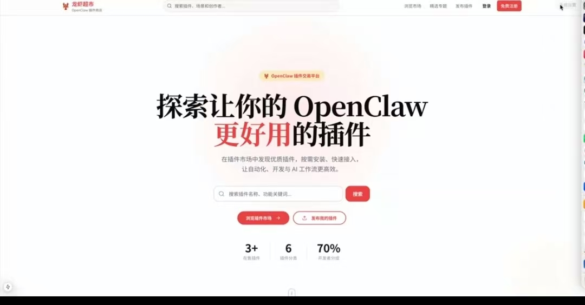
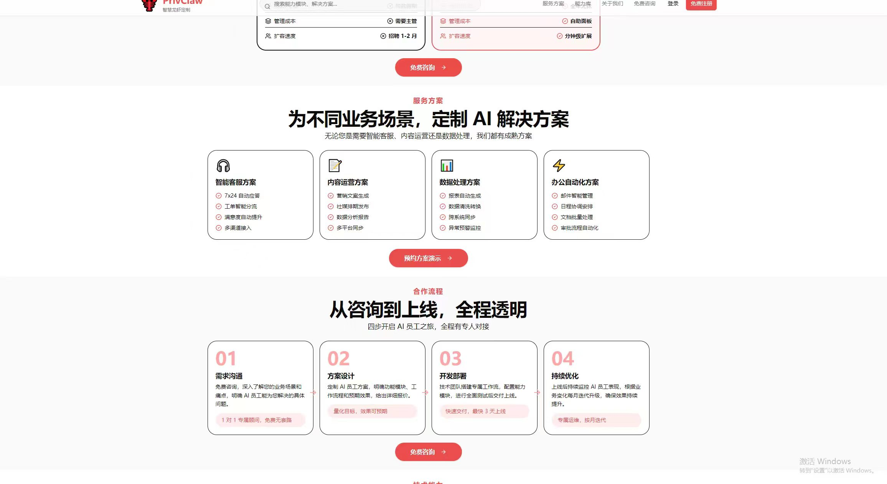
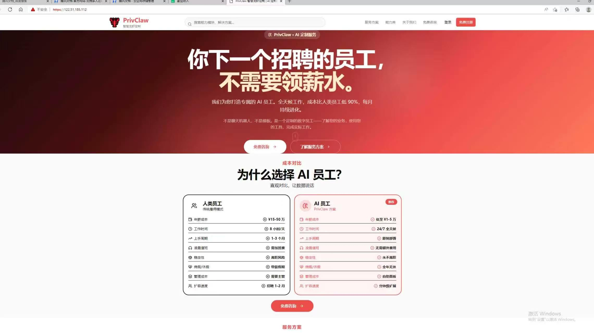
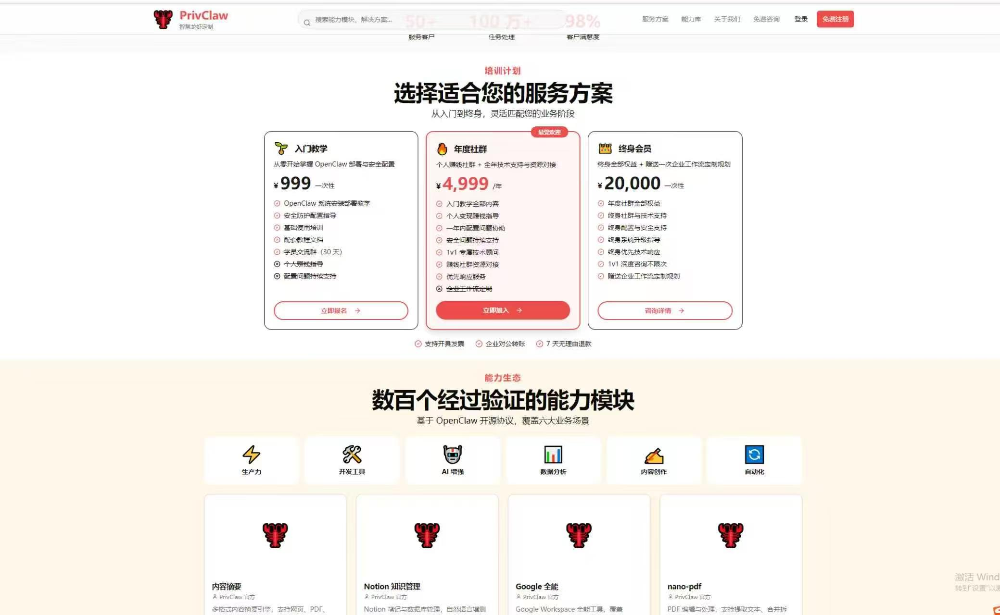

# PrivClaw

> PrivClaw is a secure, enterprise-oriented plugin marketplace, serving OpenClaw workflow customization and solving public plugin security risks for enterprises.

[](LICENSE)
[](https://www.docker.com/)
[](https://www.python.org/)
[](https://nextjs.org/)
[](https://www.postgresql.org/)
[](CONTRIBUTING.md)

> **🤝 We welcome contributions!** Check out [good first issues](https://github.com/geneleo537-afk/privclaw/labels/good%20first%20issue) to get started. All PRs are reviewed and merged quickly!

---

## Background & Business Logic

We provide enterprise-level AI workflow deployment services based on OpenClaw. When enterprises build custom AI workflows, a large number of functional plugins are required.

Public plugin hubs contain unregulated, malicious and unsafe plugins, which bring huge security risks to enterprise usage. To solve this problem, PrivClaw is built as a private, audited, secure AI plugin marketplace.

### Commercial Closed Loop

- We deploy exclusive AI workflows for enterprises.
- Enterprises can only purchase audited, high-security plugins from our platform to avoid security accidents.
- High-quality developers are invited to submit and monetize standardized plugins.
- Form a stable business ecosystem of workflow customization + official plugin supply.

---

## Why PrivClaw?

- **Full Commercialization** — Built-in Alipay payment, wallet system, revenue sharing, and withdrawal. Not a toy project.
- **One-Click Deploy** — `docker compose up -d` launches the entire stack in 30 seconds.
- **Production-Grade Architecture** — FastAPI + Next.js 15 + PostgreSQL + Redis + Celery, cleanly layered.
- **Comprehensive Documentation** — Detailed architecture docs, local implementation guide, and auto-generated API docs.
- **Full-Text Search** — PostgreSQL TSVECTOR-powered plugin search with fuzzy matching.
- **Security First** — CORS, rate limiting, security headers, JWT dual-token auth (HS256/RS256), bcrypt password hashing, AES-256-GCM sensitive data encryption.

## Quick Start

```bash
git clone https://github.com/privclaw/privclaw.git
cd privclaw
cp .env.example .env
docker compose up -d
```

Then visit:
- **Frontend**: http://localhost:3000
- **API Docs**: http://localhost:8000/docs
- **MinIO Console**: http://localhost:9001

### Demo Accounts

After running `make seed`, you'll have 3 demo accounts:

| Role | Email | Password |
|------|-------|----------|
| Admin | `admin@demo.privclaw.com` | `Admin123456` |
| Developer | `developer@demo.privclaw.com` | `Demo123456` |
| Buyer | `buyer@demo.privclaw.com` | `Demo123456` |

## Screenshots

| Home Page | Plugin Marketplace | Admin Dashboard |
|-----------|-------------------|-----------------|
|  |  |  |

| Plugin Detail |
|---------------|
|  |

## Feature Checklist

### Core Features
- [x] User Authentication (JWT dual token: access + refresh, HS256/RS256)
- [x] User Management (roles: buyer / developer / admin)
- [x] Plugin Marketplace (CRUD + version management + file upload)
- [x] Full-Text Search (PostgreSQL TSVECTOR)
- [x] Category System (tree structure)
- [x] Order System (create, list, auto-close on timeout via Celery)
- [x] Alipay Payment (face-to-face QR code + async callback)
- [x] Wallet Balance Payment
- [x] Wallet System (recharge, withdrawal, transaction records)
- [x] Admin Dashboard (user management, plugin review, order management, withdrawal review)
- [x] Object Storage (MinIO for dev / Aliyun OSS for production)
- [x] Docker Compose (development + production)
- [x] HTTPS (Nginx with self-signed cert + HSTS)
- [x] Rate Limiting (Nginx: auth 3r/m, API 30r/s, frontend 50r/s)
- [x] Security Headers (X-Frame-Options, CSP, HSTS, etc.)
- [x] Sensitive Data Encryption (AES-256-GCM)
- [x] CI/CD Pipeline (GitHub Actions + ruff + pytest coverage)

### In Progress
- [ ] WeChat Pay Integration
- [ ] Plugin Review System Frontend UI
- [ ] Admin Dashboard Data Visualization
- [ ] Refresh Token Rotation

### Planned
- [ ] Refund Workflow
- [ ] Rating & Review System
- [ ] Dark Mode
- [ ] Notification System
- [ ] Monitoring & Alerting

## Architecture

```
┌─────────────────────────────────────────────────────────────┐
│                        Nginx (443/80)                       │
│                   SSL + Reverse Proxy + Rate Limit           │
└──────────────┬──────────────────────┬───────────────────────┘
               │                      │
        ┌──────▼──────┐       ┌───────▼──────┐
        │  Frontend   │       │   Backend    │
        │  Next.js 15 │       │   FastAPI    │
        │  (3000)     │       │ Gunicorn ×4  │
        │  standalone │       │   (8000)     │
        └─────────────┘       └──────┬───────┘
                                     │
                    ┌────────────────┼────────────────┐
                    │                │                │
             ┌──────▼──────┐ ┌──────▼──────┐ ┌──────▼──────┐
             │  PostgreSQL │ │    Redis    │ │    MinIO    │
             │    (5432)   │ │   (6379)   │ │   (9000)   │
             └─────────────┘ └──────┬──────┘ └─────────────┘
                                    │
                             ┌──────▼──────┐
                             │   Celery    │
                             │   Worker    │
                             └─────────────┘
```

### Tech Stack

| Layer | Technology |
|-------|-----------|
| **Frontend** | Next.js 15 + React 19 + TypeScript 5 + TailwindCSS 4 |
| **Backend** | FastAPI 0.115.6 + Python 3.12 + SQLAlchemy 2.0 (async) |
| **Database** | PostgreSQL 16 (full-text search with TSVECTOR) |
| **Cache/Queue** | Redis 7 (Celery broker + token management) |
| **Async Tasks** | Celery 5.4.0 (order timeout auto-close) |
| **Object Storage** | MinIO (dev) / Aliyun OSS (production) |
| **Payment** | Alipay SDK (sandbox & production) |
| **State Management** | Zustand (auth persistence) + React Query (API caching) |
| **UI Components** | Radix UI + Lucide React |
| **Reverse Proxy** | Nginx (HTTPS + rate limiting + security headers) |
| **Containerization** | Docker Compose (development + production) |

## Documentation

- [API Docs](http://localhost:8000/docs) — Auto-generated Swagger UI
- [Contributing Guide](CONTRIBUTING.md) — How to contribute
- [Code of Conduct](CODE_OF_CONDUCT.md) — Community guidelines
- [Security Policy](SECURITY.md) — Reporting vulnerabilities
- [Changelog](CHANGELOG.md) — Version history

## Development

### Prerequisites

- Docker & Docker Compose
- Python 3.12+ (for running scripts locally)
- Node.js 20+ (for frontend development)

### Common Commands

```bash
# Initialize environment
make init

# Start all services
make dev

# Run database migrations
make migrate

# Seed demo data
make seed

# Run tests
make test

# View logs
make logs

# Stop all services
make down

# Production deployment
make prod
```

### Project Structure

```
privclaw/
├── backend/                 # FastAPI backend
│   ├── app/
│   │   ├── api/v1/          # RESTful API routes
│   │   ├── core/            # Config, security, dependencies
│   │   ├── models/          # SQLAlchemy ORM models
│   │   ├── schemas/         # Pydantic validation schemas
│   │   ├── services/        # Business logic layer
│   │   ├── tasks/           # Celery async tasks
│   │   └── scripts/         # Data seed scripts
│   ├── alembic/             # Database migrations
│   ├── tests/               # Pytest test suite
│   └── Dockerfile
├── frontend/                # Next.js frontend
│   ├── src/
│   │   ├── app/             # App Router pages
│   │   ├── components/      # UI components
│   │   ├── hooks/           # React Query hooks
│   │   ├── lib/             # Utilities
│   │   ├── stores/          # Zustand state management
│   │   └── types/           # TypeScript type definitions
│   └── Dockerfile
├── deploy/                  # Deployment configs
│   ├── nginx/               # Nginx reverse proxy
│   └── postgres/            # Database init scripts
├── docker-compose.yml       # Development environment
├── docker-compose.prod.yml  # Production environment
└── Makefile                 # Build commands
```

## Contributing

We welcome contributions of all kinds! Whether it's fixing bugs, adding features, improving documentation, or suggesting ideas – **every contribution matters**.

### How to Contribute

1. **Find an Issue**: Check out [open issues](https://github.com/geneleo537-afk/privclaw/issues) or create a new one.
2. **Fork & Clone**: Fork the repo and clone it locally.
3. **Create a Branch**: `git checkout -b feature/your-feature-name`
4. **Make Changes**: Write your code and add tests.
5. **Submit a PR**: Push your branch and open a Pull Request.

### Good First Issues

Look for issues labeled [`good-first-issue`](https://github.com/geneleo537-afk/privclaw/labels/good%20first%20issue) to find beginner-friendly tasks.

### Need Help?

- Read our detailed [Contributing Guide](CONTRIBUTING.md)
- Join the discussion in [Issues](https://github.com/geneleo537-afk/privclaw/issues)
- Contact me directly (see [Contact](#contact) section)

### Contributors

Thanks to all contributors who have helped make PrivClaw better:

<!-- ALL-CONTRIBUTORS-LIST:START - Do not remove or modify this section -->
<!-- prettier-ignore-start -->
<!-- markdownlint-disable -->
<table>
  <tr>
    <td align="center"><a href="https://github.com/geneleo537-afk"><br /><sub><b>geneleo537-afk</b></sub></a><br /><a href="https://github.com/geneleo537-afk/privclaw/commits?author=geneleo537-afk" title="Code">💻</a> <a href="https://github.com/geneleo537-afk/privclaw/commits?author=geneleo537-afk" title="Documentation">📖</a></td>
  </tr>
</table>
<!-- markdownlint-restore -->
<!-- prettier-ignore-end -->
<!-- ALL-CONTRIBUTORS-LIST:END -->

*Want to be here? [Submit your first PR](CONTRIBUTING.md) today!*

## License

This project is licensed under the [MIT License](LICENSE).

## Support

If you find PrivClaw useful, please consider giving it a star! Your support motivates us to keep improving.

[](https://star-history.com/#privclaw/privclaw&Date)

---

## About Me

**19 years old, a college student passionate about AI, just getting started with AI development.**

## Contact

| Platform | Details |
|----------|---------|
| WeChat | `GDDYSQ1234` |
| Email | [2354503779@qq.com](mailto:2354503779@qq.com) |